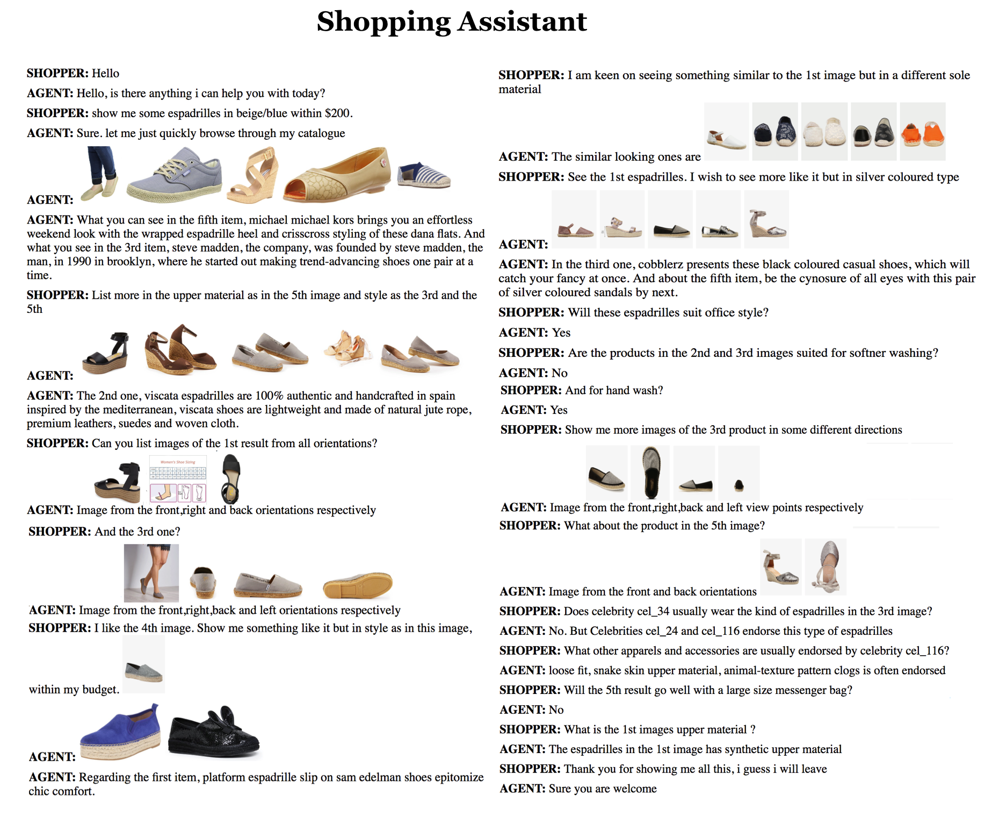

  
Abstract

 While multimodal conversation agents are gaining importance in several domains such as retail, travel etc., deep learning research in this area has been limited primarily due to the lack of availability of large-scale, open chatlogs. To overcome this bottleneck, in this paper we introduce the task of multimodal, domain-aware conversations, and propose the MMD benchmark dataset. This dataset was gathered by working in close coordination with large number of domain experts in the retail domain. These experts suggested various conversations flows and dialog states which are typically seen in multimodal conversations in the fashion domain. Keeping these flows and states in mind, we created a dataset consisting of over 150K conversation sessions between shoppers and sales agents, with the help of in-house annotators using a semi-automated manually intense iterative process. 
With this dataset, we propose 5 new sub-tasks for multimodal conversations along with their evaluation methodology. We also propose two multimodal neural models in the encode-attend-decode paradigm and demonstrate their performance on two of the sub-tasks, namely text response generation and best image response selection. These experiments serve to establish baseline performance and open new research directions for each of these sub-tasks. Further, for each of the sub-tasks, we present a 'per-state evaluation' of 9 most significant dialog states, which would enable more focused research into understanding the challenges and complexities involved in each of these states.

---
---
**CODE**

  

Github Repository for the code [repo link] (https://github.com/amritasaha1812/MMD_Code)
  

---
---
**PAPER**

<!-- Put paper arxiv link here -->
Please download the paper here [paper link](https://arxiv.org/abs/1704.00200)

---
---
**AAAI 2018 SLIDES**

<!-- Put paper arxiv link here -->
Please download the slides here [slides link](MMD_AAAI.pdf)

---
---
**BIBTEX**

@article{1704.00200,  
Author = {Amrita Saha and Mitesh M. Khapra and Karthik Sankaranarayanan}, 
Title = {Towards Building Large Scale Multimodal Domain-Aware Conversation Systems}, 
Year = {2017}, 
Eprint = {arXiv:1704.00200}, 
} 

---
---
**DATASET**

Please [Click here]({{site.baseurl}}/download/) to download the dataset.

---
---
**EXAMPLE**

<!-- Put  example here -->
{:class="img-responsive"}

---
---
### Multi-Fold Challenges of this Dataset

<table class="tg">
  <col width="80">
  <col width="130">
  <col width="130">
  <tr>
    <th class="tg-031e"><b>Type of Complexity</b></th>
    <th class="tg-031e"><b>Example Dialog State</b></th>
    <th class="tg-031e"><b>Example Utterance</b></th>
  </tr>
  <tr>
     <td class="tg-031e"><b>Long-Term Dialog Context</b></td>
     <td class="tg-031e">At the beginning of the dialog the user mentions his budget or size preference and after a few utterances, asks the agent to show something under his budget or size</td>
     <td class="tg-031e"><i>I like the 4th image. Show me something like it but in style as in this image within my budget.</i></td>
  </tr>  
  <tr> 
     <td class="tg-031e"><b>Quantitative Inferencing (Counting)</b></td>
     <td class="tg-031e">User points to the <i>n</i>th item displayed and asks a question about it</td>
     <td class="tg-031e"><i>Show me more images of the 3rd product in some different directions</i></td>
   </tr>
   <tr>  
     <td class="tg-031e"><b>Quantitative Inferencing (Sorting/Filtering)</b></td>
     <td class="tg-031e">User wants sorting/filtering of a list based on a numerical field, e.g. price or product rating</td>
     <td class="tg-031e"><i>Show me something like it but in style as in this image within my budget.</i></td>
   </tr>
   <tr>
       <td class="tg-031e"><b>Logical Inference</b></td>
       <td class="tg-031e">User likes one fashion attribute of the nth image displayed but does not like another attribute of the same</td>
       <td class="tg-031e"><i>I am keen on seeing something similar to the 1st image but in a different sole material</i></td>
   </tr>
   <tr>
   	<td class="tg-031e"><b>Visual Inference</b></td>
	<td class="tg-031e">System adds a visual description of the product alongside the images</td>
	<td class="tg-031e"><i>Viscata shoes are lightweight and made of natural jute, premium leather, suedes and woven cloth</i></td>
   </tr>
   <tr>
   	<td class="tg-031e"><b>Collective inference over multiple Images</b></td>
	<td class="tg-031e">User?s question can have multiple aspects, drawn from multiple images displayed in the current or past context</td>
	<td class="tg-031e"><i>List more in the upper material of the 5th image and style as the 3rd and the 5th</i></td>
  </tr>
  <tr>
  	<td class="tg-031e"><b>Multimodal Inference</b></td>
	<td class="tg-031e">User gives partial information in form of images and text in the context</td>
	<td class="tg-031e"><i>See the first espadrille. I wish to see more like it but in a silver colored type</i></td>
  </tr>
  <tr>	
	<td class="tg-031e"><b>Inference using domain knowledge and context</b></td>
	<td class="tg-031e">Sometimes inferences for the user?s questions go beyond the dialog context to understanding the domain</td>
	<td class="tg-031e"><i>Will the 5th result go well with a large sized messenger bag?</i></td>
  </tr>	
  <tr>
  	<td class="tg-031e"><b>Coreference or Ellipses Resolution</b></td>
	<td class="tg-031e">Temporal continuity between successive questions from the user may cause some of them to be incomplete or to refer to items or aspects mentioned previously</td>
	<td class="tg-031e"><i>Show me the 3rd product in some different directions ... What about the product in the 5th image?</i></td>
  </tr>
</table>  

---

